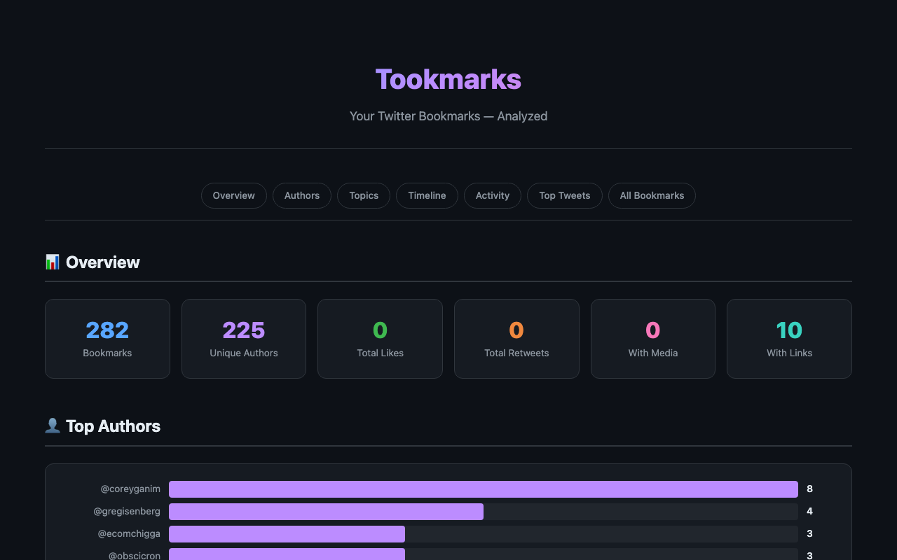
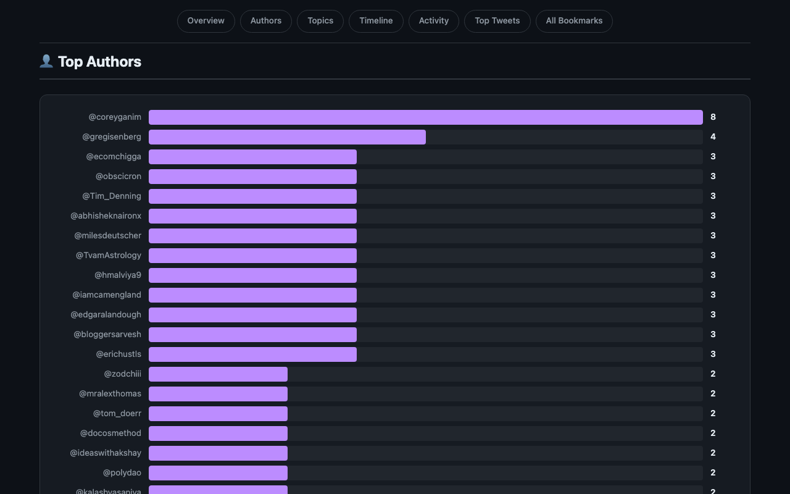
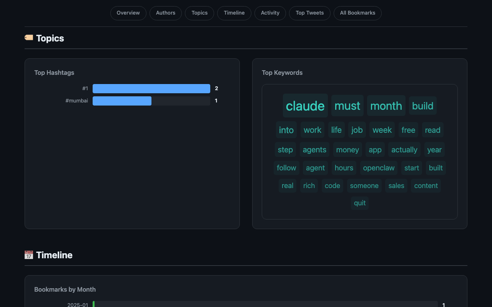
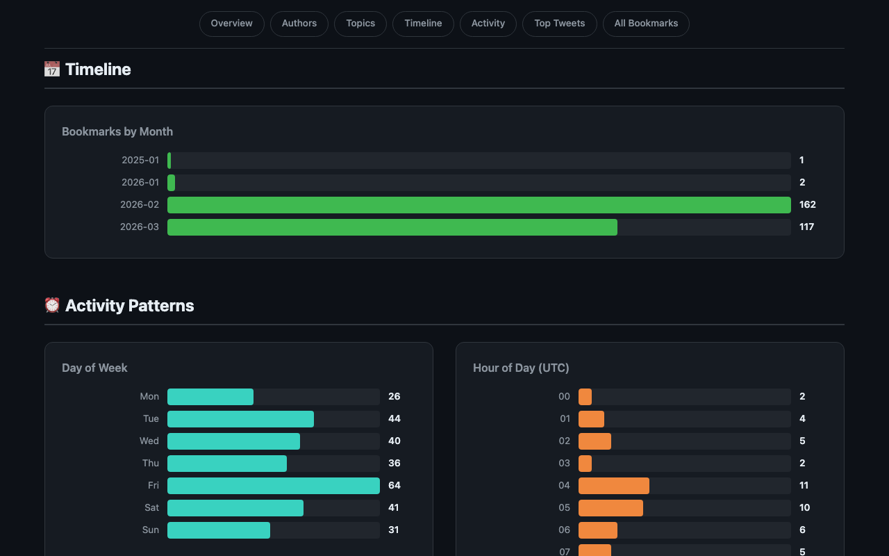
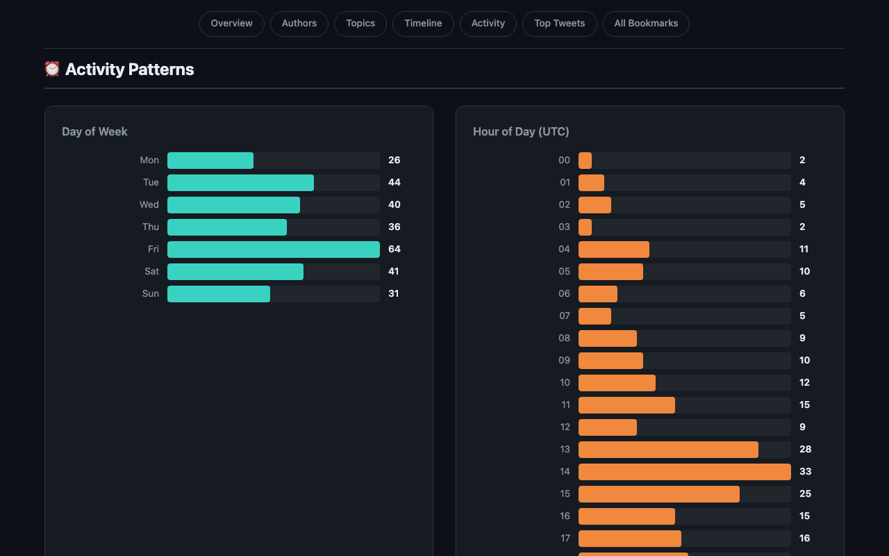
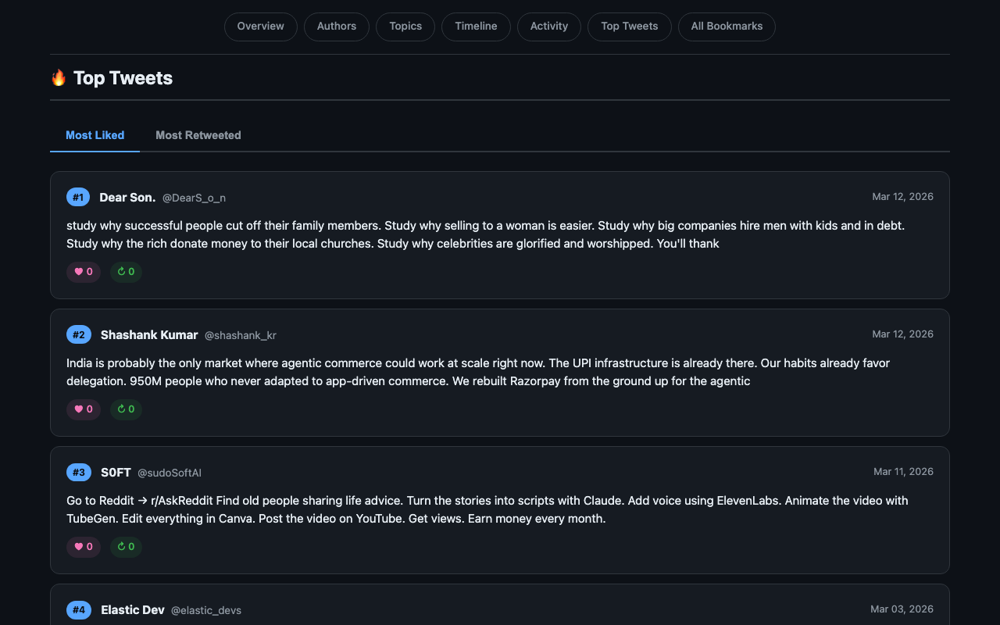

# Tookmarks

**Analyze your Twitter/X bookmarks and generate a beautiful HTML report with stats and insights.**

Built by [Apratim](https://github.com/singhapratimchandra) and [Sammit Jain](https://github.com/sammitjain).



## Features

- Overview stats: total bookmarks, unique authors, engagement metrics
- Top authors you bookmark the most
- Hashtag and keyword analysis
- Timeline of bookmarks by month
- Activity patterns: day of week and hour of day
- Top tweets by likes and retweets
- Searchable list of all bookmarks
- Dark-themed, responsive HTML report

## Screenshots

### Top Authors


### Topics — Hashtags & Keywords


### Timeline


### Activity Patterns


### Top Tweets


## Getting Started

### Option 1: Twitter Data Export (Official)

1. Go to **Settings > Your Account > Download an archive of your data** on Twitter/X
2. Wait for the export to be ready and download it
3. Find `bookmarks.js` inside the archive
4. Run:

```bash
python tookmarks.py bookmarks.js
```

### Option 2: Chrome Extension

1. Open `chrome://extensions` in Chrome
2. Enable **Developer mode**
3. Click **Load unpacked** and select the `chrome-extension/` folder
4. Navigate to [x.com/i/bookmarks](https://x.com/i/bookmarks)
5. Click the Tookmarks extension icon and hit **Export**
6. Run:

```bash
python tookmarks.py twitter_bookmarks.json
```

### Option 3: Console Scraper

1. Go to [x.com/i/bookmarks](https://x.com/i/bookmarks)
2. Open DevTools (`Cmd+Option+J` on Mac, `Ctrl+Shift+J` on Windows)
3. Paste the contents of `console_scraper.js` into the Console and press Enter
4. Wait for it to scroll through all your bookmarks — a JSON file will download automatically
5. Run:

```bash
python tookmarks.py twitter_bookmarks.json
```

## Usage

```bash
python tookmarks.py <bookmarks-file> [-o output.html]
```

| Argument | Description |
|---|---|
| `<bookmarks-file>` | Path to your `bookmarks.js` or scraped JSON file |
| `-o output.html` | (Optional) Custom output filename. Defaults to `bookmarks_report.html` |

Open the generated HTML file in your browser to explore the report.

## Sample Data

A `sample_bookmarks.js` file is included so you can try it out immediately:

```bash
python tookmarks.py sample_bookmarks.js -o sample_report.html
```

## Requirements

- Python 3.6+
- No external dependencies — uses only the Python standard library

## License

MIT
